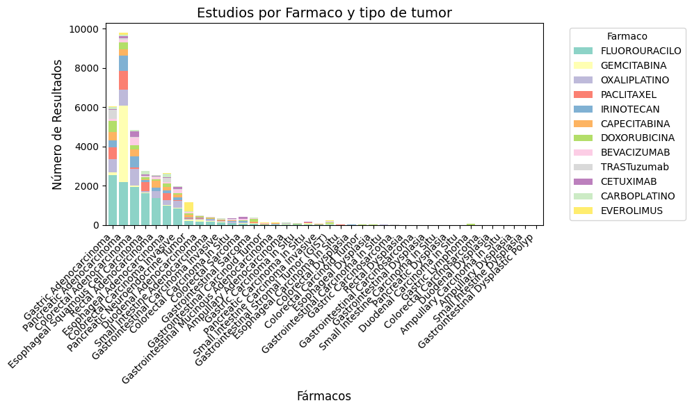
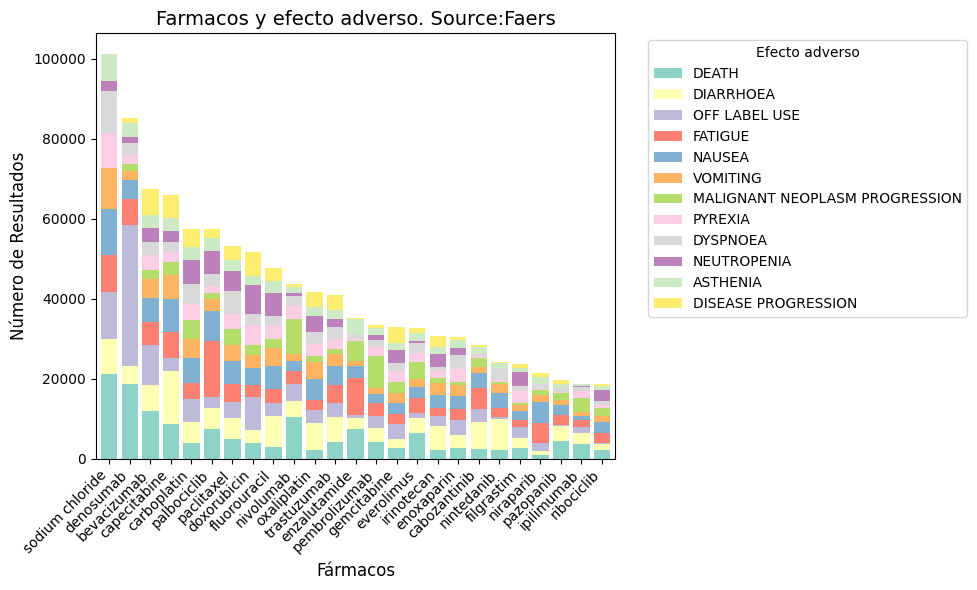

[](https://zenodo.org/doi/10.5281/zenodo.10863934)

# PubMed Co-occurrence and FAERS Analysis

This application performs a co-occurrence analysis on PubMed of two lists of terms. The use case of the application would be diseases (list 1) and drugs (list 2). The app also extracts the adverse effects from the list of drugs and allows an optional third list to filter out the adverse effects of interest.

## Features

- **Co-occurrence Analysis**: The application uses PubMed data to perform a co-occurrence analysis of disease and drug terms.




- **Adverse Effects Extraction**: In addition to the co-occurrence analysis, the application extracts adverse effects from the provided list of drugs.

    

- **Adverse Effects Filtering**: An optional third list can be used to filter adverse effects of interest, enabling a more specific and personalized analysis.

    

## Usage

1. **Data Loading**: Load the CSV files containing the lists of diseases and drugs. You can also load an additional file for the list of adverse effects, if necessary.

2. **Analysis**: Once the files are loaded, click on the "Analyze" button to start the analysis. The application will process the data and display the results of co-occurrence and adverse effects.

3. **Results Visualization**: The analysis results will be presented in the form of charts and tables, making them easy to understand and analyze.

4. **Data Download**: You can download the analysis results for further analysis or reference.

## Running Locally

To run the application locally, follow these steps:

1. Create a directory named `.streamlit` in the root directory of the project.
2. Create a file named `secrets.toml` inside the `.streamlit` directory.
3. Add your FAERS API key to the `secrets.toml` file with the following format:
    ```toml
    FAERS_API_KEY = "your_api_key_here"
    ```
You can obtain your FAERS API key <a href="https://open.fda.gov/apis/authentication/" target="_blank">here</a>.

For more information on how secrets work in Streamlit, visit <a href="https://docs.streamlit.io/streamlit-community-cloud/deploy-your-app/secrets-management" target="_blank">this link</a>.


## Built With

- Python
- Streamlit framework

## Contribution

If you find any bugs, have ideas for new features or improvements, or simply want to contribute in any way to the development of this application, feel free to open an issue or send a pull request on GitHub!

## License

This project is licensed under the [AGPLv3 License](LICENSE).

## Citation
If you use this repository in your work, please cite it as follows:

```
Bea-Mascato, B. (2024). BreisOne/literature-mining: Literature-mining app v1.0.0 (v1.0.0). Zenodo. https://doi.org/10.5281/zenodo.10863935
```
